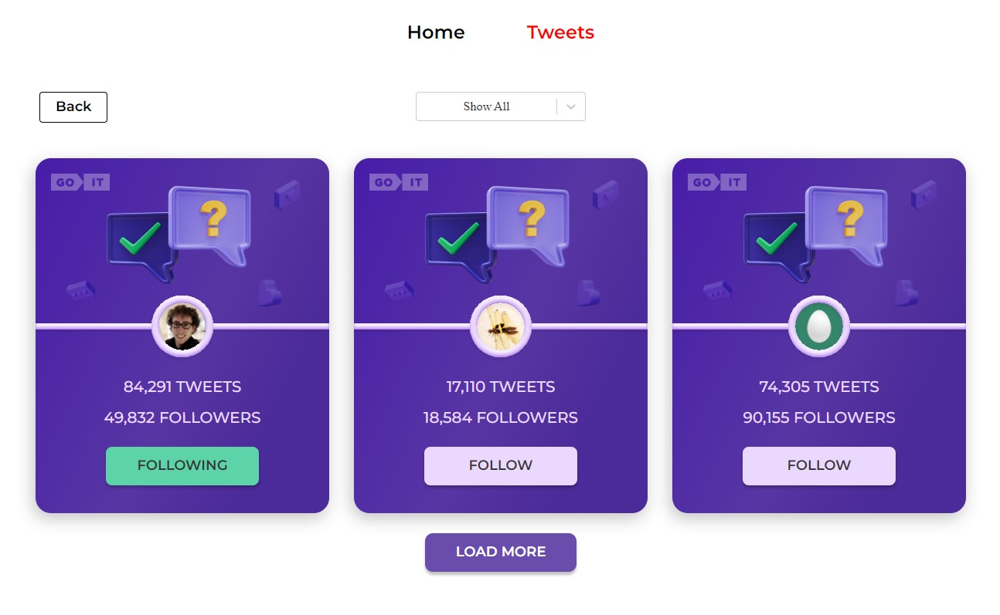

# Веб-додаток - User cards

## Підготовка

1. Склонуй репозиторій командою `git clone https://github.com/dimadimaya/tweets-cards2.0`
1. Переконайтеся, що на комп'ютері встановлено LTS-версію Node.js.
   [Скачай та встанови](https://nodejs.org/en/) її якщо необхідно.
1. Встанови базові залежності проекту командою `npm install`.
1. Для запуску, виконай команду `npm start`.
1. Перейди у браузері за адресою [http://localhost:3000/tweets-cards2.0](http://localhost:3000/tweets-cards2.0)

## Для створення фрон-енд частини Веб-додатку використовувалися:

1. [Create React App](https://github.com/facebook/create-react-app).
2. [Redux Toolkit](https://redux-toolkit.js.org/introduction/getting-started)
3. [Redux Persist](https://www.npmjs.com/package/redux-persist#basic-usage)
4. [Axios](https://axios-http.com/ru/docs/intro)
5. [React loader spinner](https://mhnpd.github.io/react-loader-spinner/docs/intro/)
6. [React router dom](https://reactrouter.com/en/main/start/tutorial)
7. [React select](https://react-select.com/home)

## Для створення бек-енд частини Веб-додатку використовувалися:

1. [Mockapi](https://mockapi.io/)

## Основний функціонал додатку:

1. Сторінка '/tweets' відображає картки юзерів із кількістю твітів і кількістю фолловерів. При клікові на кнопку Follow - текст змінюється на Following. Також
   змінюється колір кнопки. А до кількості фоловерів додається ваш (тобто +1).
2. При оновлені сторінки фіксується кінцевий результат дій юзера. Тобто,
   якщо клікнути по кнопці і оновити сторінку - то кнопка все рівно залишається
   в стані Following із відповідним кольором, а кількість фоловерів НЕ
   зменшується до початкового значення.
3. При повторному клікові на кнопку її текст та колір змінюються до початкового
   стану. Також змінюється і кількість фоловерів. Вона зменшується на 1.
4. У додатку реалізована маршрутизація:

- '/' – компонент Home, домашня сторінка.
- '/tweets’ - компонент tweets, сторінка із відображенням твітів.
  На сторінці tweets є кнопка Back, яка веде на головну сторінку. Якщо користувач зайшов за
  неіснуючим маршрутом, він потрапляє на сторінку з помилкою і кнопкою повернутися на головну(домашню) сторінку.

5. У додатку реалізована фільтрація юзерів. Це Dropdown із 3 опціями: show all, follow, followings
   show all - показати всі твіти.
   follow - показати твіти, у яких стан follow.
   followings - показати твіти, у яких стан following
