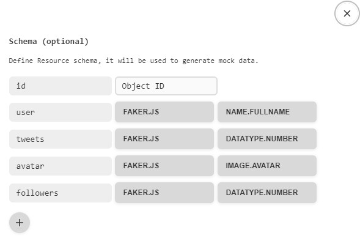

# Веб-додаток - User cards

## Підготовка

1. Склонуй репозиторій командою `git clone https://github.com/dimadimaya/tweets-cards2.0`
2. Переконайтеся, що на комп'ютері встановлено LTS-версію Node.js.
   [Скачай та встанови](https://nodejs.org/en/) її якщо необхідно.
3. Встанови базові залежності проекту командою `npm install`.
4. Для запуску, виконай команду `npm start`.
5. Перейди у браузері за адресою [http://localhost:3000/tweets-cards2.0](http://localhost:3000/tweets-cards2.0)

## Для створення фрон-енд частини Веб-додатку використовувалися:

1. [Create React App](https://github.com/facebook/create-react-app).
2. [Redux Toolkit](https://redux-toolkit.js.org/introduction/getting-started)
3. [Redux Persist](https://www.npmjs.com/package/redux-persist#basic-usage)
4. [Axios](https://axios-http.com/ru/docs/intro)
5. [React loader spinner](https://mhnpd.github.io/react-loader-spinner/docs/intro/)
6. [React router dom](https://reactrouter.com/en/main/start/tutorial)
7. [React select](https://react-select.com/home)

## Для створення бек-енд частини Веб-додатку використовувалися:

1. [Mockapi](https://mockapi.io/)

## Основний функціонал додатку:

1. Сторінка '/tweets' відображає картки юзерів із кількістю твітів і кількістю фолловерів. При клікові на кнопку Follow - текст змінюється на Following. Також
   змінюється колір кнопки. А до кількості фоловерів додається ваш (тобто +1).
2. При оновлені сторінки фіксується кінцевий результат дій юзера. Тобто,
   якщо клікнути по кнопці і оновити сторінку - то кнопка все рівно залишається
   в стані Following із відповідним кольором, а кількість фоловерів НЕ
   зменшується до початкового значення.
3. При повторному клікові на кнопку її текст та колір змінюються до початкового
   стану. Також змінюється і кількість фоловерів. Вона зменшується на 1.
4. У додатку реалізована маршрутизація:

- '/' – компонент Home, домашня сторінка.
- '/tweets’ - компонент tweets, сторінка із відображенням твітів.
  На сторінці tweets є кнопка Back, яка веде на головну сторінку. Якщо користувач зайшов за
  неіснуючим маршрутом, він потрапляє на сторінку з помилкою і кнопкою повернутися на головну(домашню) сторінку.

5. У додатку реалізована фільтрація юзерів. Це Dropdown із 3 опціями: show all, follow, followings
   show all - показати всі твіти.
   follow - показати твіти, у яких стан follow.
   followings - показати твіти, у яких стан following
   
   
   
 # Web application - User cards
   
 
   
 ## Preparation

1. Clone the repository with the command `git clone https://github.com/dimadimaya/tweets-cards2.0`
2. Make sure you have the LTS version of Node.js installed on your computer.
   [Download and install](https://nodejs.org/en/) her if necessary.
3. Set the basic dependencies of the project as a command `npm install`.
4. To start, execute the command `npm start`.
5. Go to the address in the browser [http://localhost:3000/tweets-cards2.0](http://localhost:3000/tweets-cards2.0)

## To create the front-end part of the Web application, the following were used:

1. [Create React App](https://github.com/facebook/create-react-app).
2. [Redux Toolkit](https://redux-toolkit.js.org/introduction/getting-started)
3. [Redux Persist](https://www.npmjs.com/package/redux-persist#basic-usage)
4. [Axios](https://axios-http.com/ru/docs/intro)
5. [React loader spinner](https://mhnpd.github.io/react-loader-spinner/docs/intro/)
6. [React router dom](https://reactrouter.com/en/main/start/tutorial)
7. [React select](https://react-select.com/home)

## To create the back-end part of the Web application, the following were used:

1. [Mockapi](https://mockapi.io/)

## The main functionality of the application:

1. The '/tweets' page displays user cards with the number of tweets and the number of followers. When you click on the Follow button, the text changes to Following. Also
   the color of the button changes. And yours is added to the number of followers (i.e. +1).
2. When the page is updated, the final result of the user's actions is recorded. That is,
   if you click on the button and refresh the page, the button remains the same
   in the Following state with the corresponding color, and the follower count is NOT
   decreases to the initial value.
3. When you click the button again, its text and color change to the original
   state The number of followers also changes. It decreases by 1.
4. Routing is implemented in the application:

- '/' – Home page.
- '/tweets’ - page displaying tweets.
  The tweets page has a Back button that takes you to the main page. If the user logged in for
  non-existent route, he gets to a page with an error and a button to return to the main (home) page.

5. User filtering is implemented in the application. This is a Dropdown with 3 options: show all, follow, followings
   show all - show all tweets.
   follow - show tweets with follow status.
   followings - show tweets with following status
   
   
